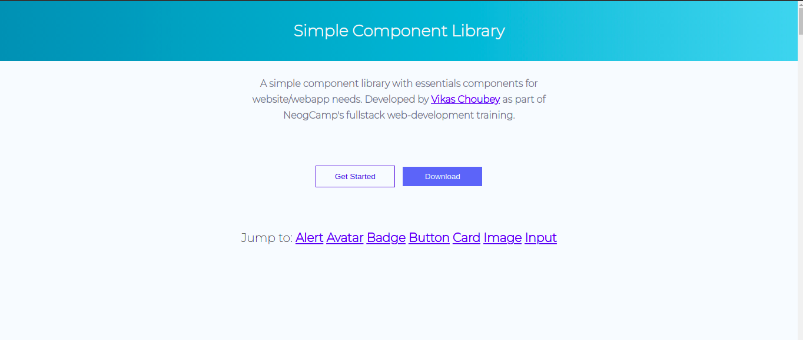

# Component-library-Docsite

#### It is a documentation website the a component ibrary I built as part of NeogCamp fullstack web developer training.

### [Visit here.](https://simple-cl.netlify.app/)

#### Component Library:

1. [Alert](https://simple-cl.netlify.app/documentation.html#alert)
1. [Avatar](https://simple-cl.netlify.app/documentation.html#avatar)
1. [Badge on Avatars](https://simple-cl.netlify.app/documentation.html#badge-avatars)
1. [Badge on Buttons](https://simple-cl.netlify.app/documentation.html#badge-buttons)
1. [Button](https://simple-cl.netlify.app/documentation.html#button)
1. [Card - Primary](https://simple-cl.netlify.app/documentation.html#card-primary)
1. [Card - Secondary](https://simple-cl.netlify.app/documentation.html#card-secondary)
1. [Image](https://simple-cl.netlify.app/documentation.html#image)
1. [Input](https://simple-cl.netlify.app/documentation.html#input)
